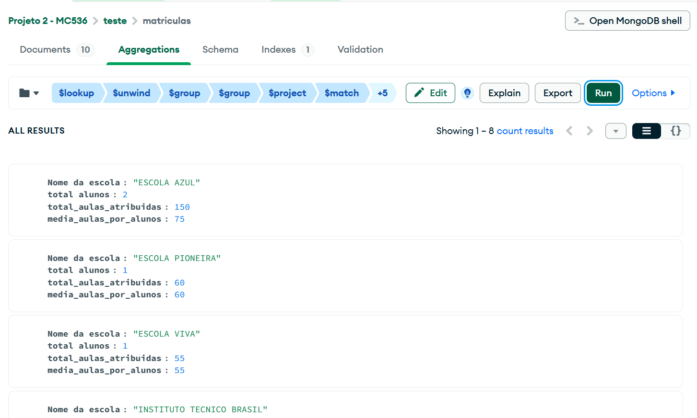
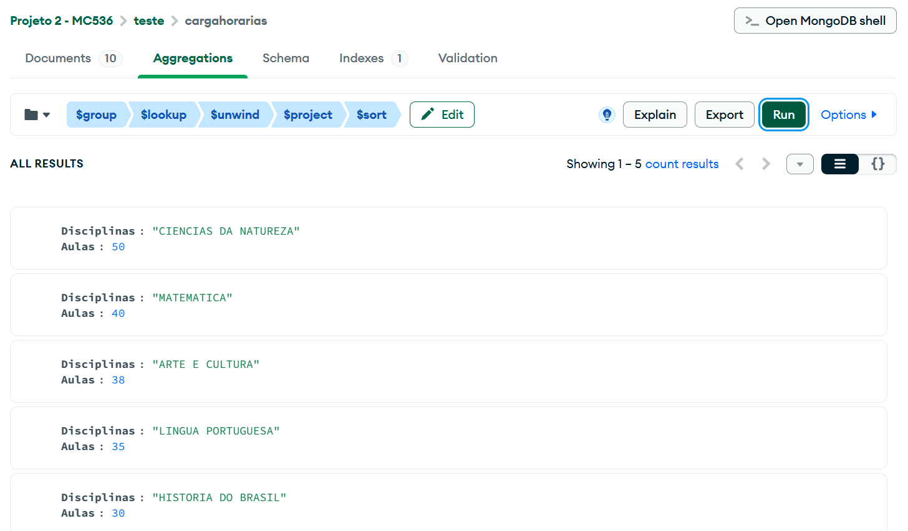
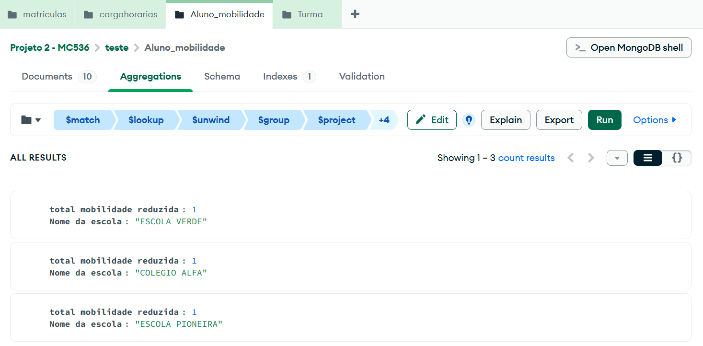
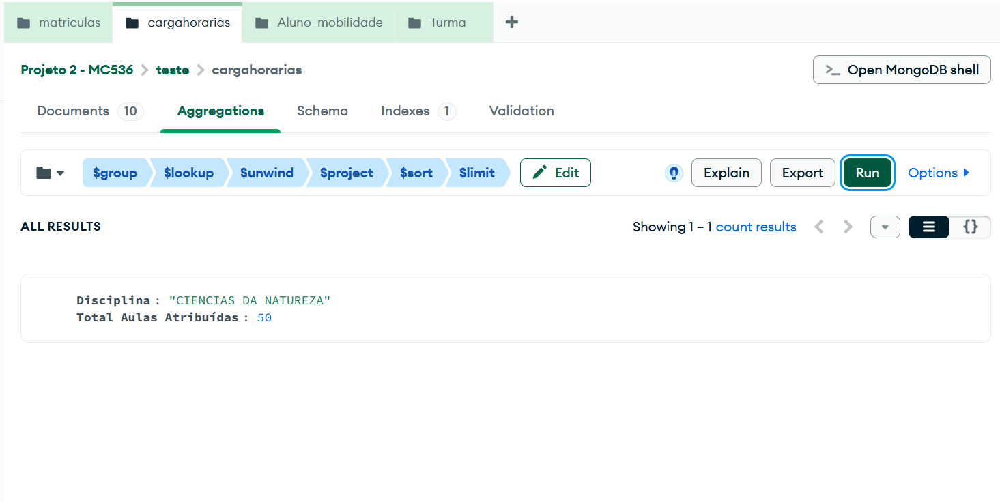

Segue as consultas realizadas com um Database menor e bem estabelecido:

## Consultas Não Triviais 
1. Média de Aulas Atribuídas por Aluno em cada Escola:
```json
[{
  "Nome da escola": "ESCOLA AZUL",
  "total alunos": 2,
  "total_aulas_atribuidas": 150,
  "media_aulas_por_alunos": 75
},
{
  "Nome da escola": "ESCOLA PIONEIRA",
  "total alunos": 1,
  "total_aulas_atribuidas": 60,
  "media_aulas_por_alunos": 60
},
{
  "Nome da escola": "ESCOLA VIVA",
  "total alunos": 1,
  "total_aulas_atribuidas": 55,
  "media_aulas_por_alunos": 55
},
{
  "Nome da escola": "INSTITUTO TECNICO BRASIL",
  "total alunos": 1,
  "total_aulas_atribuidas": 50,
  "media_aulas_por_alunos": 50
},
{
  "Nome da escola": "COLEGIO ALFA",
  "total alunos": 1,
  "total_aulas_atribuidas": 45,
  "media_aulas_por_alunos": 45
},
{
  "Nome da escola": "ESCOLA DO CAMPO",
  "total alunos": 1,
  "total_aulas_atribuidas": 38,
  "media_aulas_por_alunos": 38
},
{
  "Nome da escola": "CIDADAO ESCOLA",
  "total alunos": 1,
  "total_aulas_atribuidas": 32,
  "media_aulas_por_alunos": 32
},
{
  "Nome da escola": "ESCOLA VERDE",
  "total alunos": 1,
  "total_aulas_atribuidas": 30,
  "media_aulas_por_alunos": 30
}]
```


2. Aulas Noturnas por Aluno no Turno Noturno:
```json
[{
  "nome da escola": "ESCOLA PIONEIRA",
  "alunos noturno": 1,
  "aulas atribuidas noturno": 50,
  "aulas por auluno noturno": 50
},
{
  "nome da escola": "INSTITUTO TECNICO BRASIL",
  "alunos noturno": 1,
  "aulas atribuidas noturno": 40,
  "aulas por auluno noturno": 40
},
{
  "nome da escola": "COLEGIO ALFA",
  "alunos noturno": 1,
  "aulas atribuidas noturno": 35,
  "aulas por auluno noturno": 35
},
{
  "nome da escola": "CIDADAO ESCOLA",
  "alunos noturno": 1,
  "aulas atribuidas noturno": 0,
  "aulas por auluno noturno": 0
},
{
  "nome da escola": "ESCOLA DO CAMPO",
  "alunos noturno": 1,
  "aulas atribuidas noturno": 0,
  "aulas por auluno noturno": 0
},
{
  "nome da escola": "ESCOLA VERDE",
  "alunos noturno": 1,
  "aulas atribuidas noturno": 0,
  "aulas por auluno noturno": 0
},
{
  "nome da escola": "ESCOLA VIVA",
  "alunos noturno": 1,
  "aulas atribuidas noturno": 0,
  "aulas por auluno noturno": 0
},
{
  "nome da escola": "ESCOLA AZUL",
  "alunos noturno": 2,
  "aulas atribuidas noturno": 0,
  "aulas por auluno noturno": 0
}]
```


3. Distribuição de Aulas por disciplinas:
```json
[{
  "Disciplinas": "CIENCIAS DA NATUREZA",
  "Aulas": 50
},
{
  "Disciplinas": "MATEMATICA",
  "Aulas": 40
},
{
  "Disciplinas": "ARTE E CULTURA",
  "Aulas": 38
},
{
  "Disciplinas": "LINGUA PORTUGUESA",
  "Aulas": 35
},
{
  "Disciplinas": "HISTORIA DO BRASIL",
  "Aulas": 30
}]
```


4. Escolas com Maior Número de Matrículas de Alunos com Mobilidade Reduzida:
```json
[{
  "total mobilidade reduzida": 1,
  "Nome da escola": "ESCOLA VERDE"
},
{
  "total mobilidade reduzida": 1,
  "Nome da escola": "COLEGIO ALFA"
},
{
  "total mobilidade reduzida": 1,
  "Nome da escola": "ESCOLA PIONEIRA"
}]
```


5. Top 1 Disciplinas com Maior Número de Aulas Atribuídas:
```json
[{
  "Disciplina": "CIENCIAS DA NATUREZA",
  "Total Aulas Atribuídas": 50
}]
```
