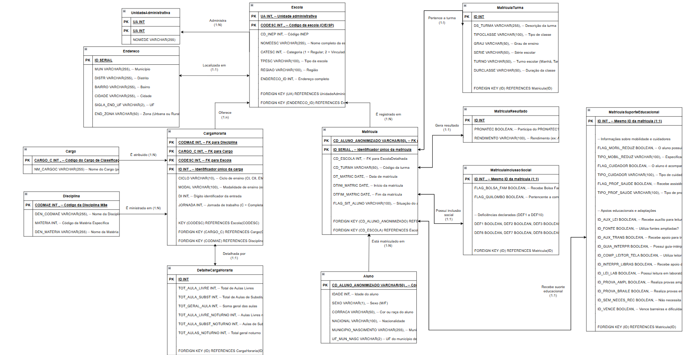
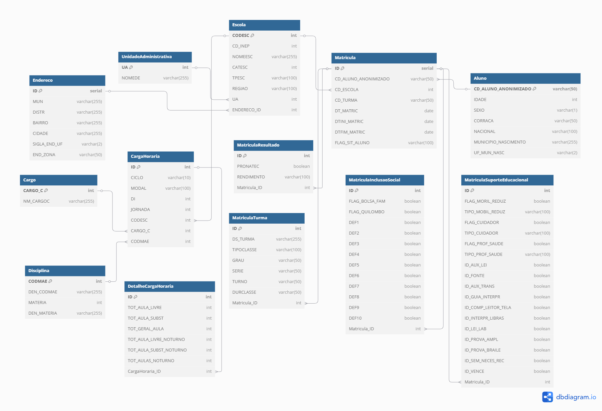

# **MC536: Projeto 1 - Educação: garantir uma educação de qualidade, inclusiva e equitativa, promovendo oportunidades de aprendizagem para todos**

## **Overview do Projeto**

**Grupo**: 16

**Nomes**:
   
    Gabriel Jeronimo da Silva | RA: 247112 
    George de Lima Sá | RA: 231529 
    Matheus Rufino da Silva | RA: 221756

**Objetivo de Desenvolvimento Sustentável**: O projeto busca analisar a relação entre a carga horária dos professores e a qualidade da educação, considerando matrículas e distribuição docente. Garantir uma educação de qualidade, inclusiva e equitativa, promovendo oportunidades de aprendizagem para todos, conforme o ODS 4 da ONU.

## **Datasets**

1. Microdados de Matrícula - SP (https://dados.educacao.sp.gov.br/dataset/microdados-de-matr%C3%ADcula-sp)
2. Carga Horária por Docente - SP (https://dados.educacao.sp.gov.br/dataset/carga-hor%C3%A1ria-por-docente)
   
Nos respectivos sites, vocês encontraram vários exemplos de datasets de diferentes datas.

**OBS**: Por conta do tamanho dos Datasets (alguns passando de 10GB de memória), o grupo optou por pegar um em específico, diminuir o número de linhas para ficar com um tamanho compatível e adaptá-lo. 

## **Modelo Conceitual**
Na imagem a seguir, é possível olhar o modelo conceitual adotado.

## **Modelo Relacional**
Na imagem a seguir, é possível olhar o modelo relacional adotado.

## **Modelo Físico**
Se encontra na pasta Modelo Físico.

## **Consultas não triviais**
As 5 consultas não triviais realizadas foram:
1. Média de Aulas Atribuídas por Aluno em cada Escola:

'''sql
SELECT 
    e.NOMEESC,
    COUNT(m.CD_ALUNO_ANONIMIZADO) AS total_alunos,
    SUM(ch.TOT_GERAL_AULA) AS total_aulas_atribuidas,
    ROUND(SUM(ch.TOT_GERAL_AULA) * 1.0 / COUNT(m.CD_ALUNO_ANONIMIZADO), 2) AS media_aulas_por_aluno
FROM CargaHoraria ch
JOIN Escola e ON ch.CODESC = e.CODESC
JOIN Matricula m ON m.CD_ESCOLA = e.CODESC
GROUP BY e.NOMEESC
HAVING COUNT(m.CD_ALUNO_ANONIMIZADO) > 50
ORDER BY media_aulas_por_aluno DESC
LIMIT 10;

3. Aulas Noturnas por Aluno no Turno Noturno:

'''sql
SELECT 
    e.NOMEESC,
    COUNT(*) FILTER (WHERE m.TURNO = 'Noturno') AS alunos_noturno,
    SUM(ch.TOT_AULAS_NOTURNO) AS aulas_atribuidas_noturno,
    ROUND(SUM(ch.TOT_AULAS_NOTURNO) * 1.0 / NULLIF(COUNT(*) FILTER (WHERE m.TURNO = 'Noturno'), 0), 2) AS aulas_por_aluno_noturno
FROM Matricula m
JOIN Escola e ON m.CD_ESCOLA = e.CODESC
JOIN CargaHoraria ch ON ch.CODESC = e.CODESC
GROUP BY e.NOMEESC
HAVING COUNT(*) FILTER (WHERE m.TURNO = 'Noturno') > 10
ORDER BY aulas_por_aluno_noturno DESC
LIMIT 10;
'''

5. Total de Aulas Atribuídas por Modalidade de Ensino e Ciclo:

'''sql
SELECT 
    ch.MODAL,
    ch.CICLO,
    SUM(ch.TOT_GERAL_AULA) AS total_aulas
FROM CargaHoraria ch
GROUP BY ch.MODAL, ch.CICLO
ORDER BY total_aulas DESC;
'''

4. Escolas com Maior Número de Matrículas de Alunos com Mobilidade Reduzida:

'''sql
SELECT 
    e.NOMEESC,
    COUNT(*) AS total_mobilidade_reduzida
FROM Matricula m
JOIN Escola e ON m.CD_ESCOLA = e.CODESC
JOIN MatriculaSuporteEducacional mse ON mse.ID = m.ID
WHERE mse.FLAG_MORIL_REDUZ = TRUE
GROUP BY e.NOMEESC
ORDER BY total_mobilidade_reduzida DESC
LIMIT 10;
'''

5. Top 10 Disciplinas com Maior Número de Aulas Atribuídas:

'''sql
SELECT 
    d.DEN_MATERIA,
    SUM(ch.TOT_GERAL_AULA) AS total_aulas
FROM CargaHoraria ch
JOIN Disciplina d ON ch.CODMAE = d.CODMAE
GROUP BY d.DEN_MATERIA
ORDER BY total_aulas DESC
LIMIT 10;
'''

Elas se encontram nos códigos nas pastas Modelo Conceitual e Modelo Relacional.

## **Implementação em Python**
Se encontra na pasta Implementação Python.
